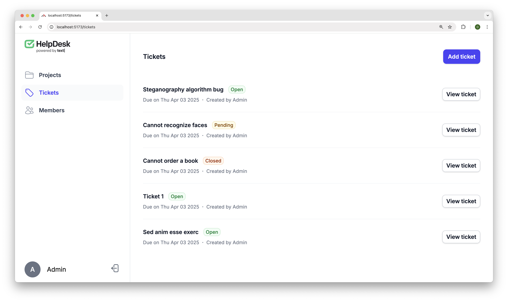
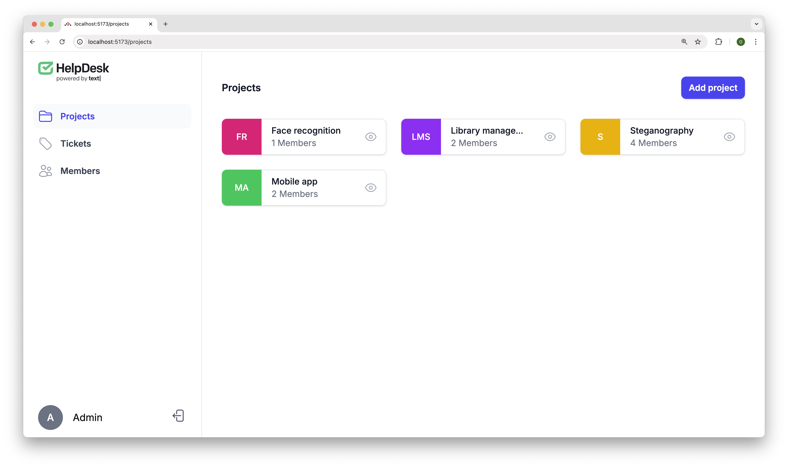
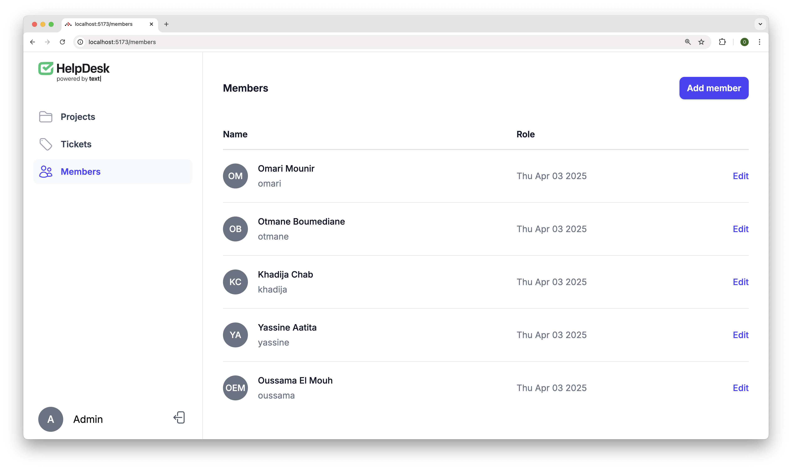

## Table des Matières

1. [Introduction](#1-introduction)  
2. [Vue d'ensemble](#2-vue-densemble)  
3. [Fonctionnalités Principales](#3-fonctionnalités-principales)  
   - [3.1 Gestion des Tickets](#31-gestion-des-tickets)  
   - [3.2 Organisation par Projets](#32-organisation-par-projets)  
   - [3.3 Gestion des Utilisateurs](#33-gestion-des-utilisateurs)  
   - [3.4 Système d'Étiquettes (Tags)](#34-système-détiquettes-tags)  
   - [3.5 États de Tickets](#35-états-de-tickets)  
4. [Structure des Données](#4-structure-des-données)  
   - [4.1 Modèle de Ticket](#41-modèle-de-ticket)  
   - [4.2 Modèle de Projet](#42-modèle-de-projet)  
   - [4.3 Modèle d'Utilisateur](#43-modèle-dutilisateur)  
   - [4.4 Relations entre les Modèles](#44-relations-entre-les-modèles)  
5. [Sécurité](#5-sécurité)  
   - [5.1 Mécanisme d'Authentification](#51-mécanisme-dauthentification)  
   - [5.2 Gestion des Rôles et Autorisations](#52-gestion-des-rôles-et-autorisations)  
6. [Architecture Technique](#6-architecture-technique)  
   - [6.1 Backend ASP.NET Core](#61-backend-aspnet-core)  
   - [6.2 Base de données PostgreSQL](#62-base-de-données-postgresql)  
   - [6.3 API REST](#63-api-rest)  
7. [Explication d'une partie de code](#7-explication-dune-partie-de-code)  
8. [Conclusion](#8-conclusion)

## 1. Introduction

Bienvenue dans la documentation de notre application de helpdesk ! Ce projet a été développé avec passion pour simplifier la gestion des tickets de support au sein de votre organisation. Notre solution combine la puissance d'ASP.NET Core avec une interface utilisateur intuitive pour vous offrir une expérience fluide et efficace.

Dans un environnement professionnel, les équipes techniques doivent fréquemment gérer un volume important de demandes simultanées. Notre application permet de centraliser et d'organiser méthodiquement les requêtes d'assistance, de les suivre jusqu'à leur résolution et de maintenir un historique précieux pour l'amélioration continue.

## 2. Vue d'ensemble

Notre application de helpdesk est conçue pour faciliter :

- La création et le suivi des tickets de support
- La gestion de projets
- La collaboration entre les équipes
- Le suivi des problèmes jusqu'à leur résolution
- La répartition équitable de la charge de travail

Techniquement, nous avons construit cette solution sur des fondations solides :

- Un backend robuste en ASP.NET Core 9.0
- Une base de données PostgreSQL performante
- Une interface utilisateur React intuitive
- Un système d'authentification sécurisé

## 3. Fonctionnalités Principales

### 3.1 Gestion des Tickets

C'est le cœur de notre application ! Vous pouvez :

- Créer des nouveaux tickets avec titre, description et niveau de priorité
- Assigner les tickets aux membres de l'équipe
- Suivre l'état d'avancement (ouvert, en attente, résolu...)
- Ajouter des tags pour mieux organiser et retrouver les tickets
- Modifier les informations quand c'est nécessaire
 


### 3.2 Organisation par Projets

On peut regrouper les tickets par projets, ce qui aide vraiment à :

- Garder une vue claire sur chaque projet
- Suivre les problèmes spécifiques à chaque équipe
- Mieux gérer les ressources et les priorités
 


### 3.3 Gestion des Utilisateurs

Notre système offre des fonctionnalités complètes pour la gestion des utilisateurs :

- Création de nouveaux utilisateurs par les administrateurs (l'auto-inscription a été désactivée pour maintenir un contrôle sur les accès)
- Authentification sécurisée via nom d'utilisateur et mot de passe
- Attribution de rôles (administrateur, membre) déterminant les actions autorisées
- Accès aux informations personnelles via un endpoint dédié

Nous avons établi deux rôles principaux : administrateur et membre. On aurait pu complexifier avec plus de rôles (comme "support niveau 1", "support niveau 2"), mais on a préféré garder ça simple et efficace pour cette première version. Pas besoin de se compliquer la vie quand on commence !


### 3.4 Système d'Étiquettes (Tags)

Pour faciliter la catégorisation et la recherche des tickets, nous avons implémenté un système d'étiquettes :

- Les étiquettes peuvent être associées aux tickets lors de leur création ou modification
- Un ticket peut avoir plusieurs étiquettes
- Les étiquettes disponibles peuvent être récupérées via un endpoint dédié

La relation many-to-many entre tickets et étiquettes a présenté des défis techniques avec Entity Framework Core, nécessitant une configuration spécifique dans notre contexte de base de données.

### 3.5 États de Tickets

Chaque ticket peut être dans l'un des états suivants, reflétant son avancement dans le processus de résolution :

- **Open** : Ticket nouvellement créé, en attente de traitement
- **AwaitingInformation** : En attente d'informations supplémentaires de la part du demandeur
- **Pending** : En cours de traitement, mais temporairement en attente
- **Resolved** : Problème résolu, en attente de confirmation du demandeur
- **Closed** : Ticket définitivement fermé après résolution satisfaisante

Ces états ont été définis après une discussion approfondie au sein de l'équipe, cherchant à représenter fidèlement le cycle de vie typique d'une demande de support.

## 4. Structure des Données

### 4.1 Modèle de Ticket

Le ticket constitue l'entité centrale de notre application. Notre classe `Ticket` comprend les propriétés suivantes :

- `Id` : Identifiant unique du ticket
- `Title` : Titre descriptif du ticket
- `Description` : Description détaillée du problème
- `Date` : Date et heure de création du ticket
- `State` : État actuel du ticket (Open, AwaitingInformation, Pending, Resolved, Closed)
- `Project` : Projet auquel le ticket est associé
- `Assignee` : Utilisateur assigné à la résolution du ticket
- `Reporter` : Utilisateur ayant signalé le problème
- `ReporterId` : Identifiant de l'utilisateur ayant créé le ticket
- `Tags` : Liste des étiquettes associées au ticket

Un aspect intéressant de notre développement concerne l'ajout tardif du champ `Reporter`. Initialement omis, nous avons dû l'intégrer alors que le projet était déjà bien avancé, nécessitant une migration de base de données. Cette expérience nous a rappelé l'importance d'une modélisation exhaustive dès les premières phases du projet.

### 4.2 Modèle de Projet

La classe `Project` présente une structure relativement simple :

- `Id` : Identifiant unique du projet
- `Title` : Titre descriptif du projet
- `Users` : Liste des utilisateurs associés au projet

Cette simplicité était voulue pour la première version, mais nous envisageons d'enrichir ce modèle dans les futures itérations avec des métadonnées supplémentaires comme des dates de début et de fin, une description détaillée, ou encore des indicateurs de priorité.

### 4.3 Modèle d'Utilisateur

Notre modèle d'utilisateur, représenté par la classe `ApplicationUser`, étend la classe `IdentityUser` fournie par ASP.NET Identity :

- Propriétés héritées : UserName, Email, PasswordHash, etc.
- `Name` : Nom complet de l'utilisateur
- `Date` : Date d'inscription
- `tickets` : Liste des tickets associés à l'utilisateur
- `Projects` : Liste des projets auxquels l'utilisateur est assigné

L'utilisation d'`IdentityUser` comme base nous a permis de bénéficier de toutes les fonctionnalités intégrées d'ASP.NET Identity, tout en étendant le modèle selon nos besoins spécifiques.

### 4.4 Relations entre les Modèles

Notre structure de données comporte plusieurs relations importantes :

- Relation one-to-many entre Project et Ticket : un projet peut contenir plusieurs tickets, mais chaque ticket appartient à un seul projet
- Relation many-to-many entre Tag et Ticket : un ticket peut avoir plusieurs étiquettes, et une étiquette peut être associée à plusieurs tickets
- Relation one-to-many entre ApplicationUser et Ticket (en tant que Reporter) : un utilisateur peut créer plusieurs tickets
- Relation one-to-many entre ApplicationUser et Ticket (en tant qu'Assignee) : un utilisateur peut être assigné à plusieurs tickets
- Relation many-to-many entre ApplicationUser et Project : un utilisateur peut être associé à plusieurs projets, et un projet peut avoir plusieurs utilisateurs associés

La mise en place de ces relations, particulièrement la relation many-to-many entre tickets et étiquettes, a nécessité une configuration spécifique dans notre `AppDbContext` pour définir correctement les tables de jointure et les clés étrangères.

## 5. Sécurité

### 5.1. Mécanisme d'Authentification

Notre application implémente un système d'authentification robuste basé sur ASP.NET Identity et les tokens JWT (JSON Web Tokens) :

- Les utilisateurs s'authentifient via l'endpoint `/login` avec leur nom d'utilisateur et mot de passe
- L'application vérifie les informations d'identification et génère un token JWT signé
- Ce token est ensuite inclus dans les requêtes API via l'en-tête Authorization
- Le middleware d'authentification valide le token pour chaque requête protégée

Lors de l'implémentation initiale, nous avions configuré une durée de validité des tokens trop courte (5 minutes), ce qui a engendré des problèmes d'expérience utilisateur. Après avoir identifié ce problème, nous avons ajusté la durée à une valeur plus appropriée.

### 5.2 Gestion des Rôles et Autorisations

Le contrôle d'accès est géré via un système de rôles :

- Deux rôles principaux sont définis : `Admin` et `Member`
- Les administrateurs ont accès à toutes les fonctionnalités
- Les membres (`Member`) ont des accès limités :
  - Consultation des tickets qui leur sont assignés
  - Modification des tickets dont ils sont responsables
  - Accès aux projets auxquels ils appartiennent
  - Création de nouveaux tickets

L'attribution de ces rôles est contrôlée exclusivement par les administrateurs. Nous avons implémenté ces restrictions à l'aide de l'attribut `[Authorize]` sur les endpoints sensibles, en spécifiant les rôles autorisés lorsque nécessaire.

## 6. Architecture Technique

### 6.1 Backend ASP.NET Core

Notre application utilise ASP.NET Core avec .NET 9.0 comme framework cible. Nous avons adopté l'approche Minimal API qui permet une définition concise des endpoints HTTP et réduit considérablement la quantité de code nécessaire par rapport à l'approche MVC traditionnelle.

L'injection de dépendances native d'ASP.NET Core a joué un rôle crucial dans notre architecture, facilitant la séparation des préoccupations et améliorant la testabilité du code.

### 6.2 Base de données PostgreSQL

Pour la gestion des données, nous utilisons :

- PostgreSQL comme système de gestion de base de données
- Entity Framework Core comme ORM (Object-Relational Mapper)
- Des migrations pour gérer l'évolution du schéma de la base de données

### 6.3 API REST

Notre API respecte les principes RESTful, avec une utilisation cohérente des verbes HTTP standards :

- GET pour la récupération de données
- POST pour la création de nouvelles ressources
- PUT pour la mise à jour de ressources existantes

## 7. Explication d'une partie de code

Le code qui gère la création des tickets dans notre système de helpdesk est le suivant :
Cette méthode gère la création des tickets dans le helpdesk. Il y a plusieurs étapes.

**Récupération du créateur du ticket :**

```csharp
var username = principal.Identity?.Name;
var reporter = await db.Users.Where(user => user.UserName == username).FirstAsync();
```

Cette étape récupère l'identité de l'utilisateur connecté qui crée le ticket. Le système recherche ensuite cet utilisateur dans la base de données pour l'associer comme créateur du ticket.

**Recherche de l'assigné et du projet :**

```csharp
var assignee = await db.Users.Where(user => user.UserName == request.Assignee).FirstAsync();
var project = await db.Projects.Where(project => project.Title == request.ProjectTitle).FirstAsync();
```

Le système recherche dans la base de données l'utilisateur qui sera responsable du ticket (assignee) et le projet concerné. Ces informations sont essentielles pour le suivi du ticket.

**Récupération des tags :**

```csharp
var tags = await db.Tags.Where(tag => request.Tags.Contains(tag.Title)).ToListAsync();
```

Les tags permettent de catégoriser le ticket. Le système récupère tous les tags demandés depuis la base de données pour les associer au ticket.

**Construction du ticket :**

```csharp
var ticket = new Ticket
{
    Title = request.Title,
    Description = request.Description,
    Reporter = reporter,
    Assignee = assignee,
    Project = project,
    State = State.Open,
    Tags = tags,
    Date = DateTime.UtcNow
};
```

Le système crée un nouveau ticket avec toutes les informations collectées. L'état initial est "Open" et la date est automatiquement définie à l'instant de création.

**Sauvegarde en base de données :**

```csharp
db.Tickets.Add(ticket);
await db.SaveChangesAsync();
```

Le ticket est ajouté à la base de données et les changements sont sauvegardés de manière asynchrone.

## 8. Conclusion

Ce que nous préférons dans ce projet, c'est l'équilibre entre facilité d'utilisation et fonctionnalités avancées. Ce projet nous a aussi permis d'apprendre le C# et ASP.NET Core en profondeur, ce qui était d'ailleurs l'objectif principal de cette démarche. Nous avons beaucoup progressé et sommes maintenant à l'aise avec ces technologies !
